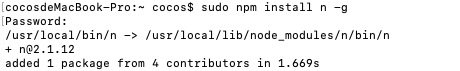
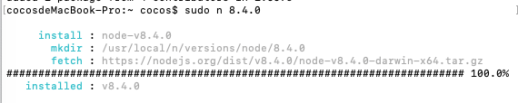

### 特别注意: 
项目使用的node版本为8.+,否则会遇到这个问题:

https://github.com/YuraDev/vue-chrome-extension-template/issues/19

我使用的是8.4.0
## 怎么切换node版本
`mac`
> 安装`n`扩展包: sudo npm i n -g    

> 安装指定版本node: sudo n 8.4.0    

> 切换版本: sudo n    

> 验证node版本: node -v    

`win`
- 补充...
